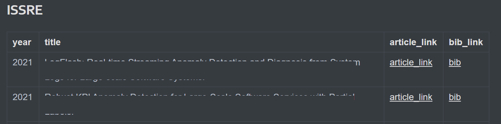

# dblp_paper_crawler
- Crawl the dblp for related papers with given venue names and key words.

## Outputs

- A Markdowm file 
  - year
  - title
  - article link
  - bibtex link
- A .npy file

## Required packages

```python
pip install lxml
pip install tqdm
pip install numpy
pip install bs4
pip install urllib
pip install requests
```
 
